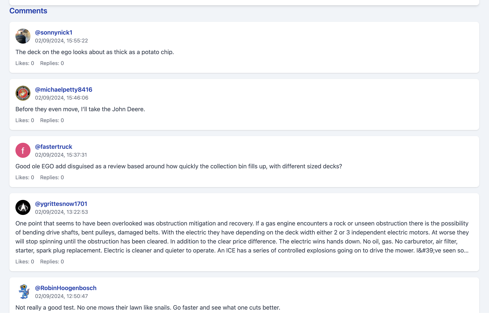
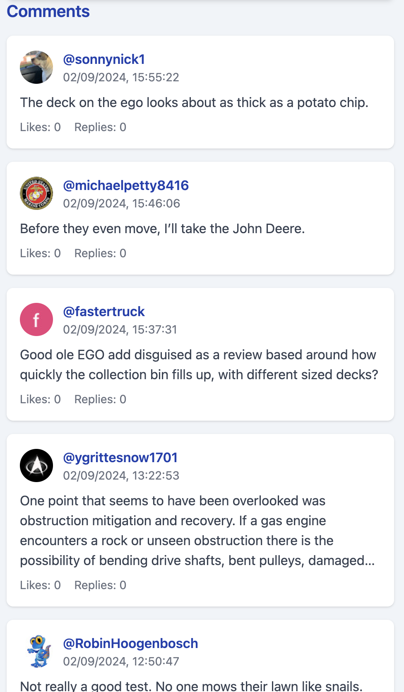

# YouTube Frontend

This project is a frontend application for interacting with YouTube video data. It's built with Vue.js and uses Tailwind CSS for styling.

## Live Demo

The live demo of this application can be accessed at:

URL: http://164.90.185.174:3010/

## Screenshots

Here's how the application looks:

_Figure 1: Main interface for entering YouTube video ID or URL_ and Display of video details


_Figure 2: Display of comments_


_Figure 1: Mobile Main interface for entering YouTube video ID or URL_ and Display of video details


_Figure 2: Display of comments_ Mobile

## Project Setup

### Environment Setup

1. Create a `.env` file in the root directory of the project with the following content:

```
VITE_API_BASE_URL=http://164.90.185.174:3009
```

### Local Development

To run the project locally:

1. Install dependencies:

   ```bash
   npm install
   ```

2. Start the development server:

   ```bash
   npm run dev
   ```

3. Build for production:

   ```bash
   npm run build
   ```

4. Lint and fix files:
   ```bash
   npm run lint
   ```

## Docker and Docker Compose

The project includes a `Dockerfile` and a `docker-compose.yml` file for containerization.

To build and run with Docker Compose:

```bash
docker-compose up -d
```

## Deployment

The project uses GitHub Actions for CI/CD. The workflow is defined in `.github/workflows/main.yml`.

To set up the workflow:

1. Go to your GitHub repository settings.
2. Navigate to "Secrets and variables" > "Actions".
3. Add the following secrets:
   - `SERVER_IP`: Your server's IP address
   - `SERVER_USERNAME`: SSH username for your server
   - `SERVER_PASSWORD`: SSH password for your server

The workflow will automatically deploy the application when changes are pushed to the `main` branch.

## Technologies Used

- Vue.js 3
- Vite
- TypeScript
- Tailwind CSS
- Axios for API requests
- Nginx (for production deployment)

## Configuration Files

- `vite.config.ts`: Vite configuration
- `tsconfig.json`: TypeScript configuration
- `tailwind.config.js`: Tailwind CSS configuration
- `nginx.conf`: Nginx configuration for production deployment

## Additional Information

- Tailwind CSS is used for styling, providing a responsive and customizable design.
- The project is set up with ESLint and Prettier for code linting and formatting.
- TypeScript is used for static typing, enhancing code quality and developer experience.

For any additional help or information, please refer to the official [Vue.js documentation](https://vuejs.org/guide/introduction.html) and [Vite documentation](https://vitejs.dev/guide/).
